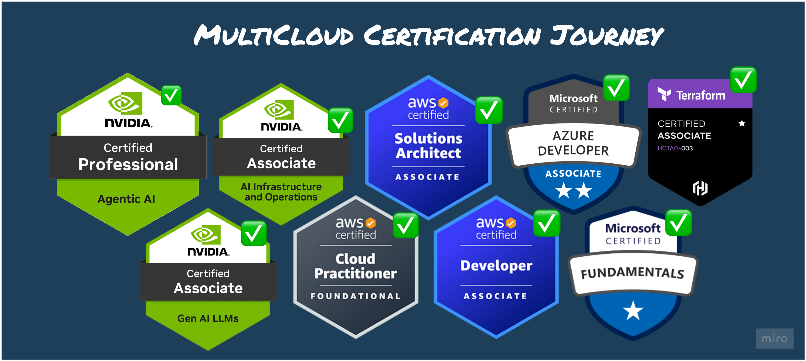

# 👋 Hi, I'm [Hitesh Sahu](https://hiteshsahu.com)

> 🚀 AI Infrastructure Engineer • GPU Systems • Cloud Native • Open Source

🌍 **Portfolio:** **https://hiteshsahu.com**


I build the infrastructure behind modern AI systems.

My work focuses on **GPU clusters**, **Slurm**, **Kubernetes**, **distributed systems**, **observability**, and **developer tooling** that makes AI workloads easier to run, benchmark, and debug.

I'm currently building an open-source ecosystem for **AI infrastructure**, including local Slurm clusters, GPU observability, HPC developer tools, and LLM benchmarking.


---

## 🏆 Certifications

[🎓 View all on Credly →](https://www.credly.com/users/hitesh-kumar-sahu.506a3000)



## AI Infrastructure Ecosystem

These projects complement each other and solve a piece of the puzzle in the AI workflow from training, inference,
deployment to monitoring


| Project                                                                                                                            | Description                                                                                                                                                                                                              | Tech                                                              |
| ---------------------------------------------------------------------------------------------------------------------------------- | ------------------------------------------------------------------------------------------------------------------------------------------------------------------------------------------------------------------------ | ----------------------------------------------------------------- |
| **[🏋️ Model Gym](https://github.com/hiteshsahu/Model-Gym)**<br><br>                     | A fitness center for AI models. Import, export, optimize, benchmark, and report LLM inference performance across engines, runtimes, and hardware platforms.                                                              | Next.js • TypeScript • Python • PyTorch • Hugging Face            |
| **[🦆 RAG Factory](https://github.com/hiteshsahu/RAG-Factory)**<br><br>                | Transforms chaotic PDFs, documents, websites, databases, and APIs into trusted answers using embeddings, retrieval, reranking, and large language models.                                                                | Python • FastAPI • LangChain • Vector Databases • OpenAI • Ollama |
| **[🐸 NVIDIA SuperPod](https://github.com/hiteshsahu/Nvidia-Super-Pod)**<br><br>          | GPU Infrastructure Lab for building an AI supercomputer from commodity GPU servers. Explore multi-node training, networking, storage, scheduling, observability, and large-scale AI infrastructure.                      | Go • Kubernetes • Slurm • NVIDIA GPUs • InfiniBand • Prometheus   |
| **[֎ GPU Lens](https://github.com/hiteshsahu/GPU-Lens)**<br><br>                          | Drop-in GPU + scheduler observability for clusters you already have. Get instant visibility into GPU health, utilization, memory, temperatures, ECC errors, XID faults, scheduler activity, and queue health.            | Go • Prometheus • Grafana • DCGM Exporter • Kubernetes • Slurm    |
| **[🦝🐾 Squint](https://github.com/hiteshsahu/Squint)**<br><br>                             | A GPU-aware Slurm monitor for your terminal. Read-only, zero-config, and runs anywhere. Visualize jobs, nodes, GPUs, queue health, and pending reasons through a fast terminal UI.                                       | Go • Bubble Tea • Lip Gloss • Slurm • TUI                         |
| **[🐪 Caravan](https://github.com/hiteshsahu/Caravan)**<br><br>                            | Spin up a complete local Slurm cluster with a single command. Develop, test, and submit HPC and AI workloads on Docker or Podman with GPU scheduling, making local experimentation fast and reproducible.            | Go • Slurm • Docker • Podman • Cobra • HPC                        |
| **[🛜 GPU-Fabric-Bench](https://github.com/hiteshsahu/GPU-Fabric-Bench)**<br><br> | Reproducible RDMA fabric benchmarking suite for NCCL GPU collective communications on AWS EFA. Maps InfiniBand concepts to cloud-native HPC networking and visualizes latency, bandwidth, topology, and scaling behavior. | NCCL • AWS EFA • RDMA • MPI • NVIDIA GPUs • Python                |

---

## 📊 GitHub Stats


## 📈 Contribution Graph

<p align="center">
  
</p>

---

## 📈 Stack Overflow

<a href="https://stackoverflow.com/users/2252113/hitesh-sahu">
  
</a>

---


## ⚙️ Tech Stack

### 🤖 AI & Machine Learning


### ⚡ GPU Computing & HPC


### 🛠 Backend & Distributed Systems


### ☸️ Cloud Native


### 📊 Observability


### 🎨 Frontend


----

<p align="center">
  <a href="https://hiteshsahu.com">
    
  </a>
  <a href="https://www.linkedin.com/in/hitesh-sahu-99639040">
    
  </a>
  <a href="mailto:hiteshkrsahu@gmail.com">
    
  </a>
  <a href="https://twitter.com/HiteshSahu_">
    
  </a>
</p>

<p align="center">
  🌍 <a href="https://hiteshsahu.com">hiteshsahu.com</a> •
  📚 <a href="https://stackoverflow.com/users/2252113/hitesh-sahu">Stack Overflow (42k+)</a>
</p>
```

